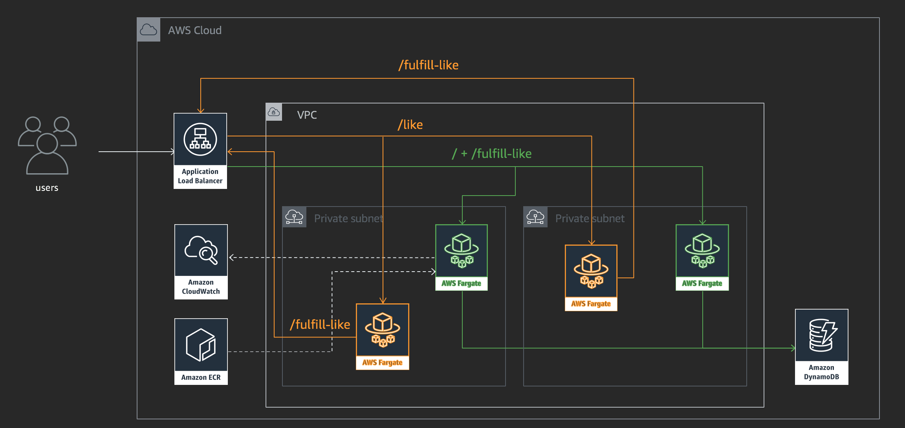
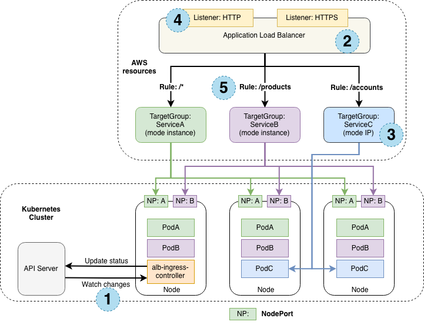
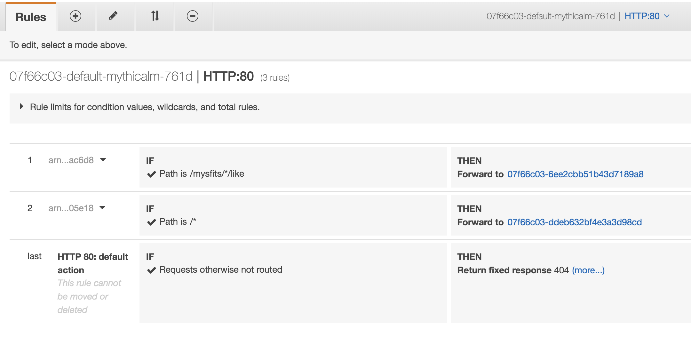
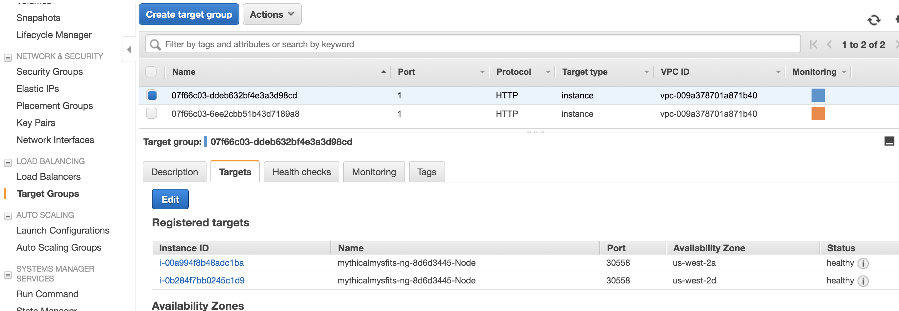

# Lab 3: Incrementally build and deploy each microservice using EKS

It's time to break apart the monolithic adoption into microservices. To help with this, let's see how the monolith works in more detail.

> The monolith serves up several different API resources on different routes to fetch info about Mysfits, "like" them, or adopt them.
>
> The logic for these resources generally consists of some "processing" (like ensuring that the user is allowed to take a particular action, that a Mysfit is eligible for adoption, etc) and some interaction with the persistence layer, which in this case is DynamoDB.

> It is often a bad idea to have many different services talking directly to a single database (adding indexes and doing data migrations is hard enough with just one application), so rather than split off all of the logic of a given resource into a separate service, we'll start by moving only the "processing" business logic into a separate service and continue to use the monolith as a facade in front of the database. This is sometimes described as the [Strangler Application pattern](https://www.martinfowler.com/bliki/StranglerApplication.html), as we're "strangling" the monolith out of the picture and only continuing to use it for the parts that are toughest to move out until it can be fully replaced.

> The ALB has another feature called [path-based routing](https://docs.aws.amazon.com/elasticloadbalancing/latest/application/load-balancer-listeners.html#path-conditions), which routes traffic based on URL path to particular target groups.  This means you will only need a single instance of the ALB to host your microservices.  The monolith service will receive all traffic to the default path, '/'.  Adoption and like services will be '/adopt' and '/like', respectively.

Here's what you will be implementing:



*Note: The green tasks denote the monolith and the orange tasks denote the "like" microservice*

    
As with the monolith, you'll be using [EKS](https://aws.amazon.com/eks/) to deploy these microservices, but this time we'll walk through all the deployment steps for a fresh service.

### Instructions:

1. First, we need to add some glue code in the monolith to support moving the "like" function into a separate service. You'll use your Cloud9 environment to do this.  If you've closed the tab, go to the [Cloud9 Dashboard](https://console.aws.amazon.com/cloud9/home) and find your environment. Click "**Open IDE**". Find the `app/monolith-service/service/mythicalMysfitsService.py` source file, and uncomment the following section:

    ```
    # @app.route("/mysfits/<mysfit_id>/fulfill-like", methods=['POST'])
    # def fulfillLikeMysfit(mysfit_id):
    #     serviceResponse = mysfitsTableClient.likeMysfit(mysfit_id)
    #     flaskResponse = Response(serviceResponse)
    #     flaskResponse.headers["Content-Type"] = "application/json"
    #     return flaskResponse
    ```

    This provides an endpoint that can still manage persistence to DynamoDB, but omits the "business logic" (okay, in this case it's just a print statement, but in real life it could involve permissions checks or other nontrivial processing) handled by the `process_like_request` function.

2. With this new functionality added to the monolith, rebuild the monolith docker image with a new tag, such as `nolike`, and push it to ECR just as before (It is a best practice to avoid the `latest` tag, which can be ambiguous. Instead choose a unique, descriptive name, or even better user a Git SHA and/or build ID):

    <pre>
    $ cd app/monolith-service
    $ docker build -t monolith-service:nolike .
    $ docker tag monolith-service:nolike <b><i>ECR_REPOSITORY_URI</i></b>:nolike
    $ docker push <b><i>ECR_REPOSITORY_URI</i></b>:nolike
    </pre>

3. Now, build the like service and push it to ECR.

    To find the like-service ECR repo URI, navigate to [Repositories](https://console.aws.amazon.com/ecs/home#/repositories) in the ECS dashboard, and find the repo named like <code><b><i>STACK_NAME</i></b>-like-XXX</code>.  Click on the like-service repository and copy the repository URI.

    

    *Note: Your URI will be unique.*

    <pre>
    $ cd app/like-service
    $ docker build -t like-service .
    $ docker tag like-service:latest <b><i>ECR_REPOSITORY_URI</i></b>:like
    $ docker push <b><i>ECR_REPOSITORY_URI</i></b>:like
    </pre>

4. Navigate to Kubernetes/micro folder `/containers-sydsummit-eks-workshop-2019/amazon-ecs-mythicalmysfits-workshop/Kubernetes`. 

Now, just as in Lab 2, create a new revision of the kubernetes object (this time pointing to the "nolike" version of the container image), AND update the monolith service to use this revision. 

Call this object nolike-app.yaml (there should be a sample file in the folder)

# Note: If you are using the nolike-app.yaml file, remember to update the image file ECR URI and update DDB Table name in the sample file provided.

5. Before we deploy this microservice, we'll go into the details of setting up the [ALB Ingress Controller](https://aws.amazon.com/blogs/opensource/kubernetes-ingress-aws-alb-ingress-controller/). 

>Kubernetes Ingress is an api object that allows you manage external (or) internal HTTP[s] access to Kubernetes services running in a cluster. Amazon Elastic Load Balancing Application Load Balancer (ALB) is a popular AWS service that load balances incoming traffic at the application layer (layer 7) across multiple targets, such as Amazon EC2 instances, in a region. ALB supports multiple features including host or path based routing, TLS (Transport layer security) termination, WebSockets, HTTP/2, AWS WAF (web application firewall) integration, integrated access logs, and health checks.

>The AWS ALB Ingress controller is a controller that triggers the creation of an ALB and the necessary supporting AWS resources whenever a Kubernetes user declares an Ingress resource on the cluster. The Ingress resource uses the ALB to route HTTP[s] traffic to different endpoints within the cluster. The AWS ALB Ingress controller works on any Kubernetes cluster including Amazon Elastic Container Service for Kubernetes (EKS). For details on how the Kubernetes Ingress works with aws-alb-ingress-controller, please [read](https://aws.amazon.com/blogs/opensource/kubernetes-ingress-aws-alb-ingress-controller/) this link. 



- Steps to deploy the AWS ALB Ingress controller
    1. Install ekcsctl (we have already done this, so skip)
    2. Create an IAM policy to give the ingress controller the right permissions:
       - Go to the IAM Console and choose the section Policies.
       - Select Create policy.
       - Embed the contents of the template [iam-policy.json](https://raw.githubusercontent.com/kubernetes-sigs/aws-alb-ingress-controller/v1.0.0/docs/examples/iam-policy.json) in the JSON section.
       - **Review policy** and save as “ingressController-iam-policy”
    3. Attach the IAM policy to the EKS worker nodes:
       - Go back to the IAM Console.
       - Choose the section **Roles** and search for the NodeInstanceRole of your EKS worker node. Example: eksctl-attractive-gopher-NodeInstanceRole-xxxxxx
       - Attach policy “ingressController-iam-policy.”
    4. Deploy the RBAC Roles and RoleBinding needed by AWS ALB ingress controller:
       ```kubectl apply -f https://raw.githubusercontent.com/kubernetes-sigs/aws-alb-ingress-controller/v1.0.0/docs/examples/rbac-role.yaml```
    5. Modify the *alb-ingress-controller.yaml* file in the **Kubernetes/micro** folder and edit the cluster name to your cluster name (that you recorded in Lab0 when setting up EKS cluster)
    6. Deploy the AWS ALB Ingress controller YAML:
       ```kubectl apply -f alb-ingress-controller.yaml```
    7. Verify that the deployment was successful and the controller started. 
       ```kubectl logs -n kube-system $(kubectl get po -n kube-system | egrep -o alb-ingress[a-zA-Z0-9-]+)```
       you should see the following output: 
        ```
            -------------------------------------------------------------------------------
            AWS ALB Ingress controller
              Release: v1.0.0
              Build: git-6ee1276
              Repository: https://github.com/kubernetes-sigs/aws-alb-ingress-controller
            -------------------------------------------------------------------------------
        ```

6. Still at this point, you'd notice on the console that the ALB has not spun up. Now we'll spin up the ALB giving the path to the two microservices that we have created (like and no like) and then deploy our alb-ingress-controller
  ```
   kubectl apply -f mythical-ingress.yaml 
   kubectl get ingress/mythical-mysfits-eks
  ```

7. Get the DNS name of the alb (kubectl get ingress) or by issuing:
```
kubectl logs -n kube-system $(kubectl get po -n kube-system | egrep -o alb-ingress[a-zA-Z0-9-]+)
```
(Example: 07f66c03-default-mythicalm-761d-1712518784.us-west-2.elb.amazonaws.com) and modify the index.html file and upload to s3 again
aws s3 cp ../../workshop-1/web/index.html s3://mythical-mysfits-core-mythicalbucket-xxx/ --grants read=uri=http://acs.amazonaws.com/groups/global/AllUsers
ALB can take 5-10 mins to be in-service

8. Take the ALB DNS name and pass it in as environment variable in the *likeservice-app.yaml* file. 
```
- name: MONOLITH_URL
  value: 07f66c03-default-mythicalm-761d-1925565151.us-west-2.elb.amazonaws.com
```
9. Now deploy both the "like" and "nolike" services. 
```
kubectl apply -f likeservice-app.yaml 
kubectl apply -f nolikeservice-app
```

10. Check your ALB on the console, it will take another 2 minutes or so for these two backend services to show as "healthy" in the target group. 



Targest showing Healthy on ALB


11. Once the state of the pods is showing as healthy, open the log files to each of the pods:
```
kubectl get pods
kubectl logs <pod name 1> (there should be 4 pods)
```
12. Navigate to the S3 URL and press the like button, as soon as you press the button, you would see the POST with a success of 200 show up and with the message "Like processed." In the next step, we will setup Fluentd with CloudWatch and you can observe the message show up in CloudWatch.

13. If you have time, you can now remove the old like endpoint from the monolith now that it is no longer seeing production use.

    Go back to your Cloud9 environment where you built the monolith and like service container images.

    In the monolith folder, open mythicalMysfitsService.py in the Cloud9 editor and find the code that reads:

    ```
    # increment the number of likes for the provided mysfit.
    @app.route("/mysfits/<mysfit_id>/like", methods=['POST'])
    def likeMysfit(mysfit_id):
        serviceResponse = mysfitsTableClient.likeMysfit(mysfit_id)
        process_like_request()
        flaskResponse = Response(serviceResponse)
        flaskResponse.headers["Content-Type"] = "application/json"
        return flaskResponse
    ```
    Once you find that line, you can delete it or comment it out.

    *Tip: if you're not familiar with Python, you can comment out a line by adding a hash character, "#", at the beginning of the line.*

14. Build, tag and push the monolith image to the monolith ECR repository.

    Use the tag `nolike2` now instead of `nolike`.

    <pre>
    $ docker build -t monolith-service:nolike2 .
    $ docker tag monolith-service:nolike <b><i>ECR_REPOSITORY_URI</i></b>:nolike2
    $ docker push <b><i>ECR_REPOSITORY_URI</i></b>:nolike2
    </pre>

    If you look at the monolith repository in ECR, you'll see the pushed image tagged as `nolike2`:

    

15. Now make one last deployment for the monolith to refer to this new container image URI (this process should be familiar now, and you can probably see that it makes sense to leave this drudgery to a CI/CD service in production), update the monolith service to use the new deployment, and make sure the app still functions as before.

### Checkpoint:
Congratulations, you've successfully rolled out the like microservice from the monolith.  If you have time, try repeating this lab to break out the adoption microservice.  You can now proceed to [Lab 4](Lab4/README.md) and setup your application monitoring with [CloudWatch](https://aws.amazon.com/cloudwatch/) and [fluentd](https://www.fluentd.org/). Otherwise, please remember to follow the steps  in the **[Workshop Cleanup](README.md##workshop-cleanup)** to make sure all assets created during the workshop are removed so you do not see unexpected charges after today.

Go [back](README.md)
